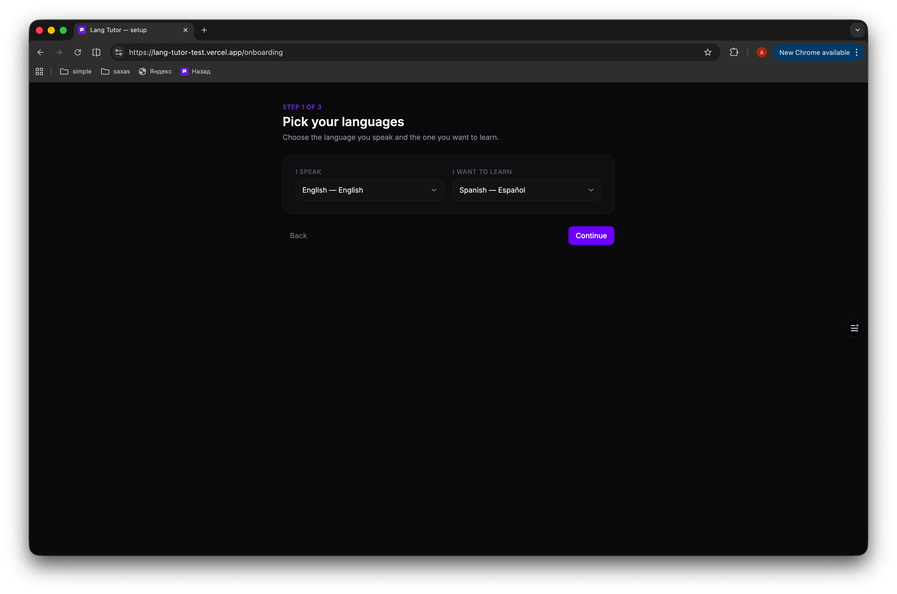
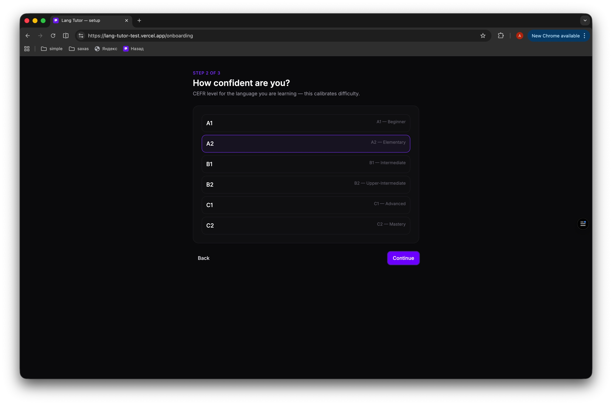
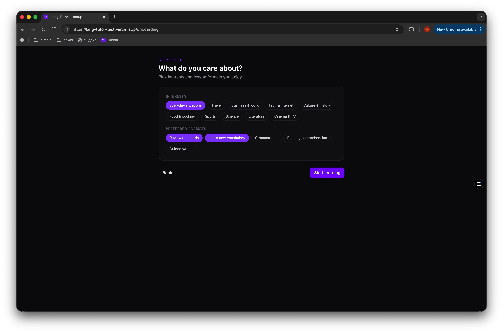
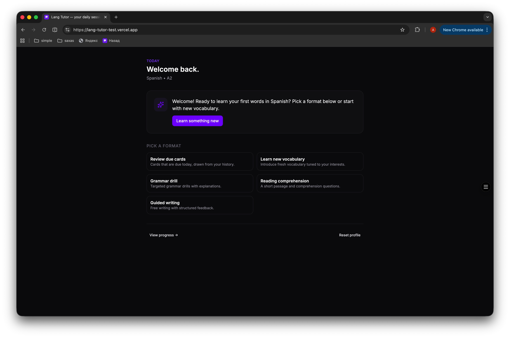
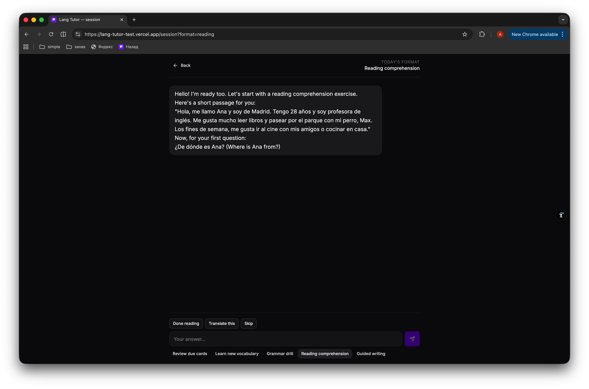

# Lang Tutor

A personal AI language tutor — chat-driven lessons, an FSRS-5 spaced-repetition engine, and an offline-first IndexedDB store. Built with SvelteKit + Svelte 5 runes, Vercel AI SDK over Gemini 2.5 Flash, and Paraglide JS for i18n.

<div align="center">

<a href="https://lang-tutor-test.vercel.app/" target="_blank" rel="noopener noreferrer">
  
</a>

</div>

## 📸 Screenshots

### Onboarding — three quick steps

<table>
  <tr>
    <td align="center" width="33%">
      
      <br/><sub><b>1. Pick your languages</b></sub>
    </td>
    <td align="center" width="33%">
      
      <br/><sub><b>2. CEFR level</b></sub>
    </td>
    <td align="center" width="33%">
      
      <br/><sub><b>3. Interests &amp; formats</b></sub>
    </td>
  </tr>
</table>

### Dashboard &amp; session

<table>
  <tr>
    <td align="center" width="50%">
      
      <br/><sub><b>Dashboard — pick a format or clear the due queue</b></sub>
    </td>
    <td align="center" width="50%">
      
      <br/><sub><b>Session — streamed reply, context-aware quick actions</b></sub>
    </td>
  </tr>
</table>

## 🚀 Quick Start

```bash
# Install dependencies
pnpm install

# Compile i18n messages
pnpm messages

# Run dev server (localhost:5173)
pnpm dev
```

Create an `.env` file from the template and add a Gemini API key:

```bash
cp .env.example .env
# then put your key in:
# GOOGLE_GENERATIVE_AI_API_KEY=...
```

## 📦 Available Commands

```bash
pnpm dev              # Run dev server
pnpm build            # Build for production (Vercel adapter)
pnpm preview          # Preview production build
pnpm messages         # Compile Paraglide i18n catalogues
pnpm check            # Typecheck (svelte-check, fail on warnings)
pnpm lint             # ESLint, max-warnings 0
pnpm lint:fix         # Auto-fix lint errors
pnpm format           # Prettier write
pnpm format:check     # Prettier check
pnpm knip             # Dead-code analysis
pnpm type-coverage    # Strict type coverage (≥ 99%)
pnpm test:unit        # Vitest watch mode
pnpm test:unit:run    # Vitest single run
pnpm test:e2e         # Playwright e2e + axe
pnpm verify           # lint • check • knip • unit tests
```

## 🏗️ Tech Stack

- **SvelteKit 2 + Svelte 5 (runes)** — UI + routing
- **TypeScript strict** — `noUncheckedIndexedAccess`, `exactOptionalPropertyTypes`, `verbatimModuleSyntax`
- **Tailwind v4 + tailwind-variants** — design tokens via `@theme`, variant-driven components
- **Vercel AI SDK + Gemini 2.5 Flash** — streamed chat with tool calling (`gradeAttempt`)
- **ts-fsrs** — FSRS-5 spaced-repetition scheduling per card
- **Dexie 4 / IndexedDB** — offline-first persistence with schema migrations
- **Paraglide JS (Inlang)** — type-safe i18n, en / ru
- **Zod 4** — runtime validation on every boundary
- **Vitest** — unit tests
- **Playwright + @axe-core/playwright** — e2e + accessibility checks
- **ESLint flat config** — unicorn, sonarjs, security, perfectionist, svelte, vitest, playwright
- **Husky + lint-staged + commitlint** — git-time enforcement

## 📁 Project Structure

```
src/
├── lib/
│   ├── ai/                  # Prompt builders, Zod schemas, tool defs, server client
│   ├── components/
│   │   ├── chat/            # Streamed message bubble
│   │   └── ui/              # Button, Card, Chip, Select, ConfirmDialog…
│   ├── database/            # Dexie client, row types, repositories
│   ├── datetime/            # dayjs facade
│   ├── domain/              # CEFR, languages, interests, lesson formats, quick actions
│   ├── env/                 # Server env validation
│   ├── i18n.svelte.ts       # Reactive Paraglide wrapper
│   ├── routing/             # Routes enum + builders
│   ├── spaced-repetition/   # ts-fsrs scheduler, card-flow, stats
│   ├── stores/              # profile.svelte (Svelte 5 reactive store)
│   ├── testing/             # Test-id constants
│   └── utils/               # cn(), markdown rendering
├── routes/
│   ├── +error.svelte        # Error boundary + 404 fallback
│   ├── +layout.svelte
│   ├── +page.svelte         # Dashboard
│   ├── onboarding/          # 3-step setup
│   ├── session/             # Chat-driven lesson
│   ├── progress/            # SRS stats
│   └── api/
│       ├── chat/+server.ts  # Streams tutor replies
│       └── grade/+server.ts # Manual grading endpoint
├── hooks.ts
└── hooks.server.ts          # Paraglide server hook
messages/                    # en.json, ru.json — Paraglide source
project.inlang/              # Paraglide project config
tests/
├── e2e/                     # Playwright specs + axe
└── fixtures.ts              # Custom test fixture, page.route mocks for /api/chat
```

## 🧠 How It Works

1. **Onboarding** — pick native + target language, CEFR level, interests and preferred lesson formats. Persisted to IndexedDB.
2. **Session** — choose a format (review / new vocab / grammar / reading / writing). The tutor streams over Server-Sent Events.
3. **Grading** — the model calls a `gradeAttempt` tool with a structured payload (rating 1–4, score 0–10, verdict, feedback). The client persists the attempt and re-schedules the card with FSRS-5.
4. **Spacing** — each card has its own stability / difficulty / due date. The dashboard surfaces what's due today and offers a queue.
5. **Progress** — streak, due-queue size, mastered vs. struggling cards (stability ≥ 21 d / < 7 d thresholds).

## 🧪 Testing

```bash
pnpm test:unit:run        # Vitest single run
pnpm test:e2e             # Playwright + axe (boots dev server, mocks /api/chat via page.route)
```

E2E tests use a Playwright fixture (`tests/fixtures.ts`) that mocks the chat stream so suites stay deterministic and don't burn API credits.

## 🚢 Deployment

Built for Vercel via `@sveltejs/adapter-vercel`. The repo is wired to Vercel's GitHub integration — pushes to `main` deploy automatically. GitHub Actions CI (`.github/workflows/ci.yml`) runs in parallel: lint • typecheck • knip • unit tests • build • e2e.

Set `GOOGLE_GENERATIVE_AI_API_KEY` in Vercel project env vars.

## 📝 Requirements

- Node.js ≥ 24
- pnpm 11.1.1 (managed via `packageManager` / corepack)
- A Gemini API key (`GOOGLE_GENERATIVE_AI_API_KEY`)

## 📄 License

MIT
